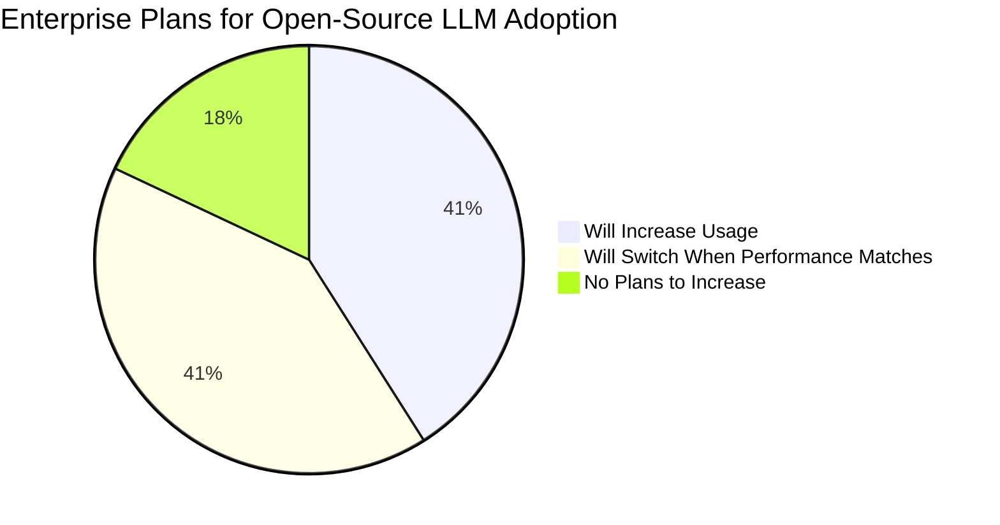
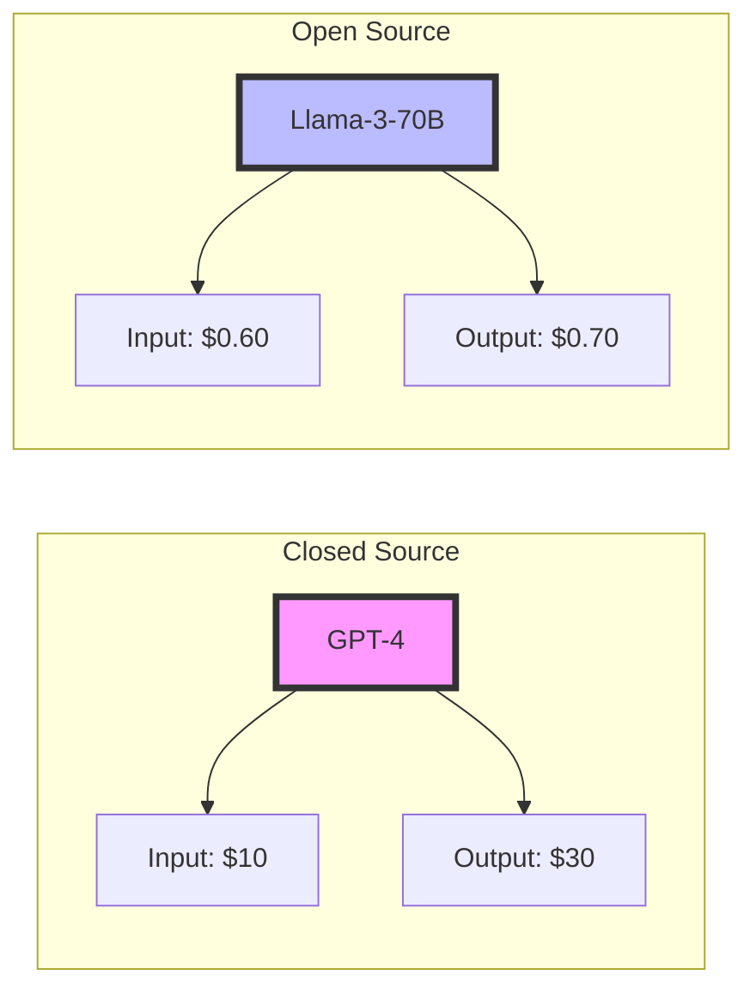
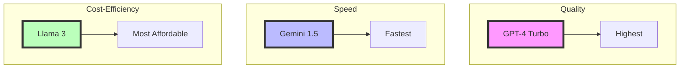
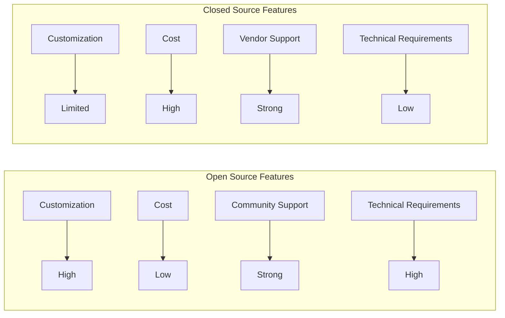

# Open-Source vs Closed-Source LLMs: A Comparative Analysis

## Market Adoption Trends (2024)



## Cost Comparison (per million tokens)



## Enterprise Priorities for Open-Source Adoption

```mermaid
bar title Key Factors Driving Enterprise Open-Source Adoption
    Control : 37
    Customizability : 37
    Cost : 26
```

## Performance Comparison (2024)



## Feature Comparison Matrix



## Open-Source LLMs

### Advantages
1. **Cost Efficiency**
   - Generally lower cost for acquisition (often free)
   - Significantly lower token processing costs (e.g., Llama-3-70-B costs ~60¢ per million tokens input)
   - More cost-effective for scaling operations

2. **Customization & Flexibility**
   - Complete freedom to modify and adapt the model
   - Can be fine-tuned for specific industry needs
   - Allows integration with existing systems as needed
   - Greater control over model behavior and outputs

3. **Transparency & Trust**
   - Code is accessible for security audits
   - Community oversight ensures ethical development
   - Clear understanding of how the model works
   - Ability to verify and validate training data

4. **Community Support**
   - Global developer community for troubleshooting
   - Collaborative improvement and innovation
   - Shared knowledge and resources
   - Regular community-driven updates

### Disadvantages
1. **Technical Requirements**
   - Requires significant in-house expertise
   - Need for specialized talent for maintenance
   - Complex integration process
   - Higher technical overhead for deployment

2. **Resource Investment**
   - Requires dedicated team for maintenance
   - Higher total cost of ownership due to staffing needs
   - Need for continuous monitoring and updates
   - Investment in infrastructure for deployment

## Closed-Source LLMs

### Advantages
1. **Ease of Use**
   - Ready-to-use solutions
   - Streamlined integration process
   - Professional vendor support
   - Regular maintenance and updates provided

2. **Professional Support**
   - Dedicated customer service
   - Vendor-managed security updates
   - Technical assistance for integration
   - Compliance certification support

3. **Reliability & Performance**
   - Guaranteed performance standards
   - Consistent updates and improvements
   - Stable and tested features
   - Enterprise-grade reliability

4. **Security & Compliance**
   - Vendor-managed security measures
   - Industry compliance certifications
   - Protected intellectual property
   - Controlled data access

### Disadvantages
1. **Cost**
   - Higher initial licensing fees
   - Ongoing subscription costs
   - Higher token processing costs (e.g., GPT-4 costs ~$10-30 per million tokens)
   - Additional fees for premium features

2. **Limited Flexibility**
   - Restricted customization options
   - Dependent on vendor for updates
   - Limited control over model behavior
   - Fixed feature sets

3. **Vendor Lock-in**
   - Dependent on provider's ecosystem
   - Limited ability to switch providers
   - Restricted by licensing agreements
   - Bound by vendor's terms of service

## Selection Guide

Choose Open-Source LLMs if:
- You need maximum customization flexibility
- You have strong technical expertise in-house
- Cost efficiency is a priority
- You require full transparency and control
- You want to avoid vendor lock-in

Choose Closed-Source LLMs if:
- You need immediate deployment with minimal setup
- You lack internal AI expertise
- You require enterprise-grade support
- You prioritize ease of use over customization
- You need guaranteed performance levels
